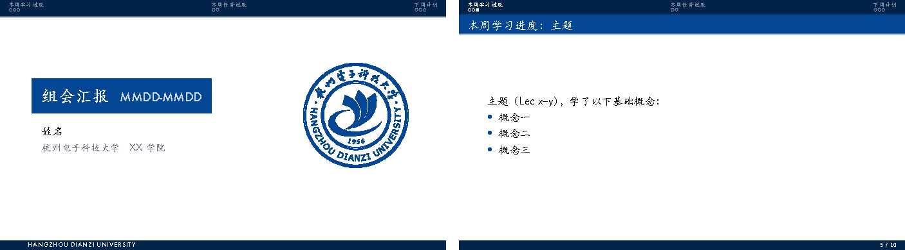

# HDU-Beamer-Theme

杭州电子科技大学的 Beamer 主题，平时拿来做周报和组会汇报。

在 [THU-Beamer-Theme](https://github.com/Trinkle23897/THU-Beamer-Theme) 的基础上改的，整体版式保留原版的样子，配色换成了校徽蓝。



## 和原版的区别

- 配色换成校徽蓝 `#034694`，校徽换成杭电的
- 16:9，中文全部用楷体
- 封面重新排了：左边蓝色标题块，右边校徽，底部一条校名色带
- 页脚只留页码，去掉了右下角的导航小图标
- 列表圆点和上一行文字左对齐

## 使用

需要 XeLaTeX（TeX Live / MacTeX 完整版即可）。把整个文件夹复制一份，改 `main.tex`，然后编译两遍：

```bash
xelatex main.tex
xelatex main.tex
```

`main.tex` 里已经搭好了周报的结构：本周学习进度、本周任务进度、下周计划。

自己新建文档的话，只需要 `beamerthemeHDU.sty` 和 `beamerthemeHDU-logo.pdf` 两个文件：

```latex
\documentclass[aspectratio=169]{ctexbeamer}
\usetheme{HDU}
```

封面要用校名色带代替页码，按下面这样写：

```latex
{\setbeamertemplate{footline}[hdu title]
\begin{frame}
  \titlepage
\end{frame}}
```

## 安装到 TeX（可选）

把主题放进个人 texmf 目录后，任何文件夹里的文档都能直接 `\usetheme{HDU}`，不用再复制主题文件。macOS 上：

```bash
mkdir -p ~/Library/texmf/tex/latex/HDU-Beamer
ln -s "$PWD/beamerthemeHDU.sty" "$PWD/beamerthemeHDU-logo.pdf" ~/Library/texmf/tex/latex/HDU-Beamer/
```

用的是软链接，之后 `git pull` 更新主题就直接生效。Linux 上把路径换成 `~/texmf/tex/latex/HDU-Beamer`。

## 字体

- 中文：macOS 用系统自带的 Kaiti SC，Windows 用 KaiTi
- 封面上的日期和英文校名用 Futura，没有的话会换成默认无衬线字体
- 结尾的 Thanks! 用的是 calligra，TeX Live 完整版自带

## License

和原版一样，以 [LPPL-1.3c](LICENSE) 发布。
